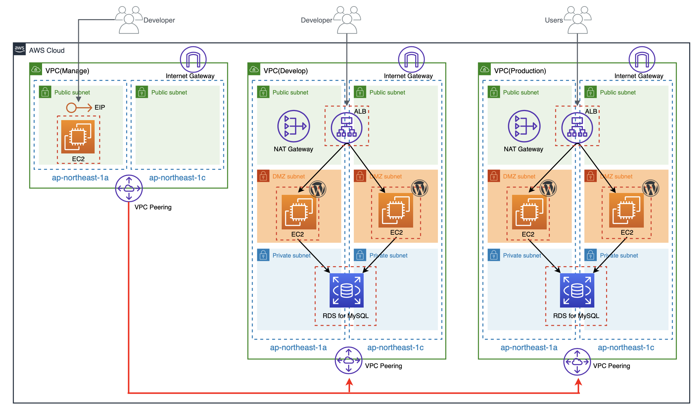

# Practice Test: AWS Multi Environment

## 概要
- 複数の環境が存在するインフラを構築するための演習課題です
- 構成図通りの構成をAWSで構築してもらいます
- 課題は3つのフェーズがあり、1フェーズごとに正しく構築出来ているかの確認を行います

## 注意事項
- マネジメントコンソールへのログイン情報は厳重に取り扱ってください
- EC2とRDSは使わない時間帯は停止してください

## 構成図
 

## 構築(フェーズ1)

### 1. タスク
- 管理環境を作成してください

### 2. 要件
- VPC
    - vpc-practice-mng
        - CIDRはRFC1918で規定されているプライベートIPアドレス範囲から任意で割り当てる
- Subnet
    - subnet-practice-mng-public-1a
    - subnet-practice-mng-public-1c
        - CIDRはRFC1918で規定されているプライベートIPアドレス範囲から任意で割り当てる
- Internet Gateway
    - igw-mng
- Security Group
    - practice-bastion-sg
        - インバウンドのSSHを許可
- EC2
    - practice-bastion
        - Amazon Linux 2
        - t3.micro
        - EBS(8GB)
        - subnet-practice-mng-public-1aに起動
        - practice-bastion-sgを紐づける
        - EXCLUDE_TERMINATE:trueをタグとして付与
- EIP
    - practice-bastionに割り当てる

### 3. 確認項目
- 要件通りに構築されていること
- practice-bastion に対してec2-userでSSH接続が出来ること

## 構築(フェーズ2)

### 1. タスク
- 開発環境を作成してください

### 2. 要件
- VPC
    - vpc-practice-dev
    - CIDRはRFC1918で規定されているプライベートIPアドレス範囲から任意で割り当てる
- Subnet
    - subnet-practice-dev-public-1a
    - subnet-practice-dev-public-1c
    - subnet-practice-dev-dmz-1a
    - subnet-practice-dev-dmz-1c
    - subnet-practice-dev-private-1a
    - subnet-practice-dev-private-1c
    - CIDRはRFC1918で規定されているプライベートIPアドレス範囲から任意で割り当てる
- Internet Gateway
    - igw-dev
- Internet Gateway
    - natgw-dev
        - subnet-practice-dev-dmz-1aに起動
- Security Group
    - alb-dev-sg
        - インバウンドのHTTPを許可
    - ec2-dev-sg
        - ALBからのHTTPを許可
        - practice-bastionからのSSHを許可
    - rds-dev-sg
        - EC2からのMySQL(3306)を許可
- VPC Peering
    - vpc-practice-mngと接続
- EC2
    - practice-dev-web01
        - Amazon Linux 2
        - t3.micro
        - EBS(8GB)
        - subnet-practice-dev-dmz-1aに起動
        - ec2-dev-sgを紐づける
        - EXCLUDE_TERMINATE:trueをタグとして付与
    - practice-dev-web02
        - Amazon Linux 2
        - t3.micro
        - EBS(8GB)
        - subnet-practice-dev-dmz-1cに起動
        - ec2-dev-sgを紐づける
        - EXCLUDE_TERMINATE:trueをタグとして付与
- セットアップ
    - 以下ミドルウェアをEC2インスタンスにインストール
        - Apache(2.4)
        - PHP(7.3)
    - バーチャルホストを設定
        - example-dev.com (ServerName)
        - /var/www/vhost/example-dev.com/public_html (DocumentRoot)
        - WordPress(latest)を配置
- ALB
    - alb-practice-dev
        - 以下サブネットに起動
            - subnet-practice-dev-public-1a
            - subnet-practice-dev-public-1c
        - alb-dev-sgを紐づける
        - 以下のインスタンスを紐づける
            - practice-dev-web01
            - practice-dev-web02
- RDS
    - practice-dev-db01
        - MySQL(5.7)
        - db.t3.micro
        - ストレージ(自動拡張有効)
        - 以下サブネットに起動
            - subnet-practice-dev-private-1a
            - subnet-practice-dev-private-1c
        - rds-dev-sgを紐づける

### 3. 確認項目
- 要件通りに構築されていること
- practice-bastionを踏み台にしてpractice-dev-web01にSSH接続できること
- ブラウザからexample-dev.comにアクセスしたときにWordPressの画面が表示されること

## 構築(フェーズ3)

### 1. タスク
- 本番環境を作成してください

### 2. 要件
- VPC
    - vpc-practice-prod
    - CIDRはRFC1918で規定されているプライベートIPアドレス範囲から任意で割り当てる
- Subnet
    - subnet-practice-prod-public-1a
    - subnet-practice-prod-public-1c
    - subnet-practice-prod-dmz-1a
    - subnet-practice-prod-dmz-1c
    - subnet-practice-prod-private-1a
    - subnet-practice-prod-private-1c
    - CIDRはRFC1918で規定されているプライベートIPアドレス範囲から任意で割り当てる
- Internet Gateway
    - igw-prod
- Internet Gateway
    - natgw-prod
        - subnet-practice-prod-dmz-1aに起動
- Security Group
    - alb-prod-sg
        - インバウンドのHTTPを許可
    - ec2-prod-sg
        - ALBからのHTTPを許可
        - practice-bastionからのSSHを許可
    - rds-prod-sg
        - EC2からのMySQL(3306)を許可
- VPC Peering
    - vpc-practice-mngと接続
- EC2
    - practice-prod-web01
        - Amazon Linux 2
        - t3.micro
        - EBS(8GB)
        - subnet-practice-prod-dmz-1aに起動
        - ec2-prod-sgを紐づける
        - EXCLUDE_TERMINATE:trueをタグとして付与
    - practice-prod-web02
        - Amazon Linux 2
        - t3.micro
        - EBS(8GB)
        - subnet-practice-prod-dmz-1cに起動
        - ec2-prod-sgを紐づける
        - EXCLUDE_TERMINATE:trueをタグとして付与
- セットアップ
    - 以下ミドルウェアをEC2インスタンスにインストール
        - Apache(2.4)
        - PHP(7.3)
    - バーチャルホストを設定
        - example-prod.com (ServerName)
        - /var/www/vhost/example-prod.com/public_html (DocumentRoot)
        - WordPress(latest)を配置
- ALB
    - alb-practice-prod
        - 以下サブネットに起動
            - subnet-practice-prod-public-1a
            - subnet-practice-prod-public-1c
        - alb-prod-sgを紐づける
        - 以下のインスタンスを紐づける
            - practice-prod-web01
            - practice-prod-web02
- RDS
    - practice-prod-db01
        - MySQL(5.7)
        - db.t3.micro
        - ストレージ(自動拡張有効)
        - 以下サブネットに起動
            - subnet-practice-prod-private-1a
            - subnet-practice-prod-private-1c
        - rds-prod-sgを紐づける

### 3. 確認項目
- 要件通りに構築されていること
- practice-bastionを踏み台にしてpractice-prod-web01にSSH接続できること
- ブラウザからexample-prod.comにアクセスしたときにWordPressの画面が表示されること

## 構築(フェーズ4)

### 1. タスク
- 開発/本番で正常に動作していない部分を直してください
- どのように解決したのかを説明してください

### 2. 問題
- 画像付きで記事を投稿すると画像が表示される時とされない時がある

### 3. 問題の再現方法
- WordPressの管理画面から画像付きで記事を投稿する
- 何度がブラウザ画面をリロードする

### 4. 確認項目
- 問題が解決されていること